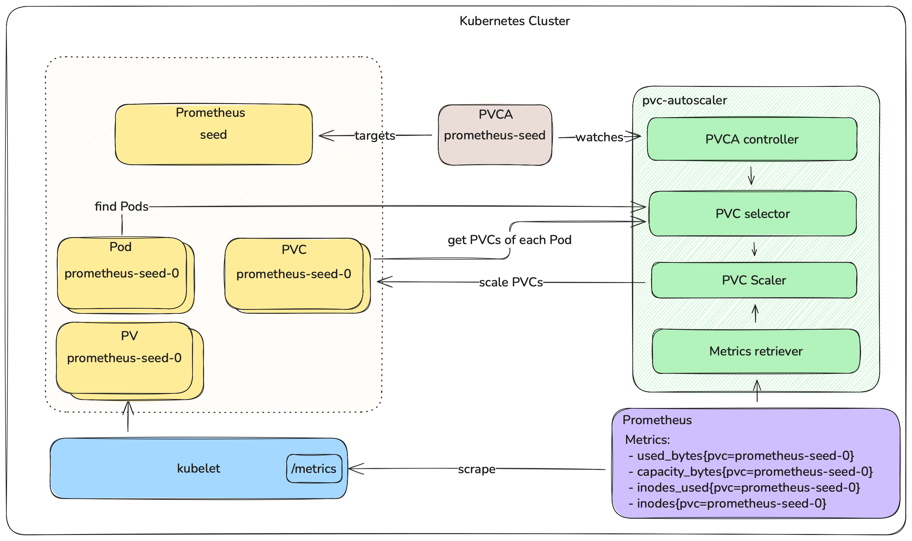
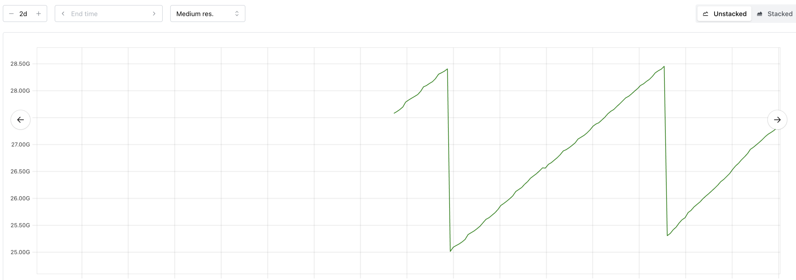
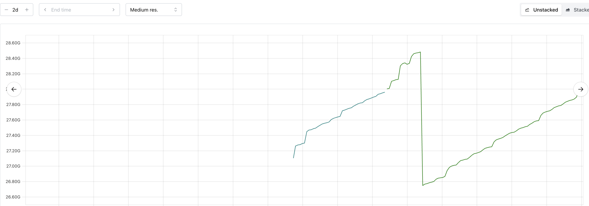
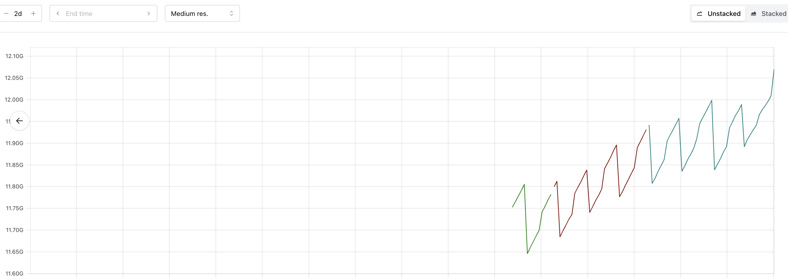
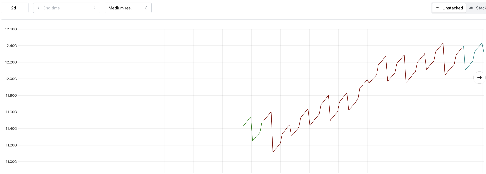

- ✍🏻 **Author(s):** [@Kostov6](https://github.com/Kostov6) Viktor Kostov, [@plkokanov](https://github.com/plkokanov) Plamen Kokanov

# Autoscaling PersistentVolumeClaims

## Table of Contents

- [Table of Contents](#table-of-contents)
- [Motivation](#motivation)
- [Proposal](#proposal)
  - [Core Concept](#core-concept)
  - [Example API Design](#example-api-design)
  - [Key Features](#key-features)
  - [Scaling Algorithm](#scaling-algorithm)
  - [Architecture Overview](#architecture-overview)
  - [Gardener Integration](#gardener-integration)
- [Impact and Alternatives](#impact-and-alternatives)
  - [Risks, Downsides and Trade-offs](#risks-downsides-and-trade-offs)
  - [Scaling Algorithm and API Alternatives](#scaling-algorithm-and-api-alternatives)
  - [Alternative 3rd Party PVC Autoscalers](#alternative-3rd-party-pvc-autoscalers)
- [Decision Request](#decision-request)
- [Appendix](#appendix-optional)

## Motivation

### Problem Statement

Gardener currently provisions PersistentVolumeClaims (PVCs) for its observability components (Prometheus, Vali, etc.) with fixed, relatively large storage sizes - we operate under tight resource constraints and logging stack PVs default to a static size of 30GB, for ALL `Shoot` clusters. This one-size-fits-all approach is necessary to accommodate clusters of varying workload intensities, but it leads to significant inefficiencies:

- **Under-provisioning risks for growing clusters**: Storage requirements grow organically as clusters scale and generate more metrics and logs. Without autoscaling, clusters risk running out of storage, which can lead to data loss, observability gaps, or service disruptions. To prevent this from happening and bringing down the logging stack, older logs are periodically removed. As a result, in some very large or busy clusters, this strategy allows retention of logs only for 2-3 days.
- **Over-provisioning for small clusters**: A cluster with minimal workloads has the same storage allocation as a large production cluster, however it might operate with just 5-10% of its observability volumes utilized.
- **Manual intervention overhead**: Currently, storage adjustments require manual intervention and coordination, creating operational burden and delaying response to storage pressure.
Additionally, gardener stakeholders and `Shoot` owners provision PVCs for their own workload and run into similar inefficiencies when managing a large number of clusters.

### Why this matters

Storage costs represent a significant portion of infrastructure expenses, especially at scale.
Across hundreds or thousands of Gardener-managed clusters, over-provisioned storage accumulates substantial unnecessary costs.
Additionally, the operational overhead of monitoring storage usage and manually resizing PVCs diverts team resources from more valuable work.

More critically, inadequate storage can compromise observability.
When Prometheus or Vali runs out of space, teams can lose older observability signals for their clusters and this can make solving issues and creating root cause analyses much harder as crucial logs can get deleted.

A way to resolve these issues is to automatically adapt the size of PVCs to fit the actual usage requirements of each workload.

### Who Benefits

- **Platform operators** gain automated storage management, reducing manual toil and operational risk while optimizing infrastructure costs across their cluster fleet.
- **End users** benefit from reliable observability services that automatically adapt to their cluster's needs without service interruptions or data loss.
- **Stakeholders** see reduced cloud spending through right-sized storage allocation that matches actual usage patterns rather than worst-case scenarios.

## Proposal

We propose to enhance the existing [`pvc-autoscaler`](https://github.com/gardener/pvc-autoscaler) project to reconcile a new Custom Resource Definition (CRD) that enables declarative autoscaling of PersistentVolumeClaims (PVCs).

### Core Concept

The autoscaler will introduce a `PersistentVolumeClaimAutoscaler` CRD that allows users to define scaling policies for PVCs associated with workload controllers (e.g., StatefulSets, Deployments, CustomResources like Prometheus and others).
The autoscaler will monitor volume usage and automatically adjust PVC sizes based on configurable thresholds and policies.

### Example API Design

```yaml
apiVersion: autoscaling.gardener.cloud/v1alpha1
kind: PersistentVolumeClaimAutoscaler
metadata:
  name: prometheus-seed
spec:
  targetRef:
    apiVersion: apps/v1
    kind: Prometheus
    name: seed
  volumeClaimPolicies:
  - minCapacity: 2Gi
    maxCapacity: 5Gi
#   match:
#    regex: ".*"
#    selector:
#      matchLabels:
#        foo: bar
#      matchExpressions:
#        key: foo
#        operator: In
#        values: ["bar"]
    scaleUp:
      cooldownDuration: 180s
      stabilizationWindowDuration: 3000s
      thresholdPercent: 80
      stepPercent: 25
      minStepAbsolute: 1Gi
      strategy: InPlace | RestartPodsIfNecessary | Off
    scaleDown:
      cooldownDuration: 180s
      stabilizationWindowDuration: 3000s
      thresholdPercent: 60
      stepPercent: 25
      minStepAbsolute: 1Gi
      strategy: Rsync | OnVolumeDeletion | Off
status:
  conditions:
  - type: PersistentVolumeClaimsScaled
    status: "Progressing"
    lastTransitionTime: "2025-08-07T11:59:54Z"
    message: |
      Some PersistentVolumeClaims have not been scaled:
      - PVC prometheus-seed-1 is being scaled due to passing inodes threshold. Current size 3Gi does not match target size 4Gi.
  persistentVolumeClaims:
  - persistentVolumeClaimName: prometheus-seed-0
    usedSpacePercentage: "30%"
    usedInodesPercentage: "20%"
    currentSize: 4Gi
    targetSize: 4Gi
    usedByPods: ["prometheus-seed-0"]
  - persistentVolumeClaimName: prometheus-seed-1
    usedSpacePercentage: "90%"
    usedInodesPercentage: "70%"
    currentSize: 3Gi
    targetSize: 4Gi
    usedByPods: ["prometheus-seed-1"]
```

### Key Features

#### Automatic PVC Discovery

The autoscaler will automatically identify PVCs to manage by examining the controller specified in `targetRef`. This will be achieved by:
- Using the `/scale` subresource to identify pods belonging to the controller, similar to VPA and HPA.
- Optionally traversing the `OwnerReferences` chain of pods to find the top-most controller and validate if it matches the `targetRef`.
- Listing all PVCs that are mounted in the identified pods.

#### Volume-Specific Policies:

The `volumePolicies` section allows control over specific volumes using regex or selector based matching, enabling different scaling behaviors for different volume types (e.g., data vs. WAL volumes).
By default, if no regex or selector is specified, the configurations in the `PersistentVolumeClaimAutoscaler` resource apply to all PVCs that are identified by the `pvc-autoscaler`.

#### Scale-Up Capabilities (Initial Version):

- Monitor volume usage against configurable thresholds.
- Check if the storage class of the identified PVC supports volume expansion.
- Automatically increase PVC size when utilization exceeds thresholds.
- Support for percentage-based and absolute minimum step increases.
- Cooldown periods to prevent rapid successive scaling operations.
- Configurable pod restart strategies (manual or automatic).

#### Capacity Constraints

`minCapacity` and `maxCapacity` ensure PVCs stay within reasonable bounds, preventing excessive costs or insufficient storage.

#### Observability and Monitoring

The autoscaler exposes Prometheus metrics for monitoring and alerting:
- `pvc_autoscaler_resized_total` - Total number of times a PVC has been resized (labeled by namespace, PVC name and owning PVCA name)
- `pvc_autoscaler_threshold_reached_total` - Total number of times the utilization threshold has been reached (labeled by namespace, PVC name, owning PVCA name and reason: space or inodes)
- `pvc_autoscaler_max_capacity_reached_total` - Total number of times the max capacity has been reached for a PVC (labeled by namespace, PVC name and owning PVCA name)
- `pvc_autoscaler_skipped_total` - Total number of times a PVC has been skipped from reconciliation (labeled by namespace, PVC name, owning PVCA name, and reason)

These metrics enable operators to track autoscaling behavior, identify capacity planning needs, and set up alerts for when PVCs reach maximum capacity.

More metrics can be added in the future.

### Scaling Algorithm

The PVC autoscaler employs a **simple threshold-based scaling approach** that makes scaling decisions based on current utilization metrics:

#### Scale-Up Decision Logic

1. Query current volume usage (disk space and inodes) metrics:
   - `kubelet_volume_stats_available_bytes` - Available bytes on the volume
   - `kubelet_volume_stats_capacity_bytes` - Total capacity of the volume
   - `kubelet_volume_stats_inodes_free` - Number of free inodes
   - `kubelet_volume_stats_inodes` - Total number of inodes
2. Calculate current utilization percentage for both space and inodes
3. If storage or inodes usage exceeds `utilizationThresholdPercent` (e.g., 80%), trigger a scale-up operation
4. Calculate new size: `max(currentSize * (1 + stepPercent/100), currentSize + minStep)`
6. Respect cooldown periods to prevent thrashing
7. Cap at `maxCapacity` for scaling up, and at `minCapacity` for downscaling

#### Downscaling (Potential Future Development)

Downscaling PVCs is significantly more complex than upscaling because it requires:
- Safe data migration to smaller volumes.
- Coordination with application downtime or maintenance windows.
- Risk mitigation for potential data loss.
- Downscaling of some PVCs could result in a size smaller than the one specified in the workload controller that manages the PVC. Depending on the controller, it might try to scale up the PVC back to its original size.
- Data migration via VolumeSnapshot does not work as smaller PVCs cannot be created from VolumeSnapshots that were taken from volumes with a larger storage size.
This means an external tool (e.g. a pod that runs rsync or some backup-restore functionality similar to [`etcd-backup-restore`][1]) is required to migrate the data.

The initial version of `pvc-autoscaler` will focus on the immediate value of preventing storage exhaustion through automated scale-up.
For these reasons we will postpone the implementation of downscaling and potentially only do it if the requirements for it outweigh the downsides.
Additionally, the task of downscaling will be implemented as part of a separate controller or an external tool.
The `pvc-autoscaler` will only be responsible for triggering downscaling and monitoring the status of the operation.
One possible approach is to offer a plugin mechanism, allowing stakeholders to write their own downscaling logic which is specific to their application.

### Architecture Overview

The following diagram illustrates the high-level architecture and workflow of the PVC autoscaler:



### Gardener Integration

The `pvc-autoscaler` is integrated into Gardener as a seed system component, deployed by `gardenlet` as part of the seed reconciliation flow.
It runs as a Deployment in the seed's `garden` namespace.
Its primary driving signal is the PVC metrics from the seed's cache Prometheus instance.

In this initial iteration, pvc-autoscaler scales two categories of `Vali` and `Prometheus` volumes: those in `Shoot` namespaces, and those in the `Seed`'s garden namespace.

The `Vali` and `Prometheus` component deployers (part of `gardenlet`'s `Shoot` reconciliation flow) create `PersistentVolumeClaimAutoscaler` resources for their respective workloads.
The `pvc-autoscaler` discovers and scales PVCs for both `Shoot`-level and `Seed`-level observability components.

Whether the `pvc-autoscaler` is deployed in a `Seed` cluster is determined by a new boolean field in the `Seed` API, which is disabled by default.
Operators can set the field to `true` on a seed-by-seed basis for gradual rollout.
An API field was chosen instead of a feature gate to cover cases for cloud providers that might not support resizing PVCs.

When `pvc-autoscaler` is enabled, initial sizes will be reduced from current defaults for newly created volumes.
The new sizes will be determined by examining the storage usage of observability components across all current `Shoot` and `Seed` clusters.
This approach enables efficient resource utilization while allowing growth as needed.

## Impact and Alternatives

### Risks, Downsides and Trade-offs

#### Metrics used for volume stats are still ALPHA

The metrics used to determine the storage utilization are in ALPHA stage and might change in the future.
Any such changes to the metrics will be caught by tests in the `pvc-autoscaler` repository, when support for a new kubernetes version is added.

#### Latency

The pipeline which propagates the volume metrics in Gardener, driving `pvc-autoscaler`, is as follows:
1. `kubelet` collects PV state data and publishes resource metrics. Default poll interval: 1 minute
2. The `Seed`'s cache Prometheus polls the metrics provided by `kubelet`. Default poll interval: 1 minute.
3. `pvc-autoscaler` polls the seed's cache Prometheus instance. Poll interval: 1 minute.

The reaction time, until `pvc-autoscaler` **initiates** a volume resize, can thus exceed 4 minutes.
The resize operation itself, including the file system resize, can further take a few minutes.
The cumulative delay, roughly estimated to be up to 10-12 minutes, is mitigated via an appropriate safety margin, provided by the choice of utilization level, configured as a scaling trigger threshold.

#### Cloud Provider Limitations

Different cloud providers impose specific constraints on volume resizing that affect the autoscaler's behavior:

**AWS (ebs.csi.aws.com)**:
EBS volumes can only be resized once every 6 hours.
This means if multiple scaling events are triggered in rapid succession, subsequent resize operations will fail until this period expires.
Failed resize attempts due to this limit are retried in the next reconciliation cycle.
PVCA's `cooldownSeconds`, `stepPercent` and `minStep` have to be configured to larger values to accommodate the less frequent scale-ups.

**Azure**:
Some Azure virtual machine types do not support resizing attached volumes while pods are running on that VM.
Volume resize operations may require pod eviction depending on the VM configuration.
This can cause additional disruption beyond normal PVC resizing operations.
By using the `strategy` field for scale-up operations, users can specify how their workload should be handled in such cases.

#### Dependency on `csi-resizer`

As the `csi-resizer` is a failure point we have no control over, PVC upscaling may fail because of it.
In that case there is nothing that can be done to prevent volume exhaustion.
Even if the volume is exhausted the worst outcome of it would be:

1. For logging - missing old logs
2. For metrics - hitting possible issue of Prometheus getting stuck in `CrashLoopbackOff` (currently possible due to bug of invalid wal record leading to volume exhaustion [ref][2])

### Scaling Algorithm and API Alternatives

#### VPA's Historical Approach

At first glance, it seems like the PersistentVolumeClaimAutoscaler API should be similar to the VerticalPodAutoscaler (VPA) API as both scale resources vertically.
However, VPA is based on a much more complex, harder to reason and debug algorithm which uses historical data, histograms and percentiles, which dictates the way that the VPA API is designed.
VPA's recommendation engine analyzes resource usage over time windows, calculates percentiles (typically p95 or p99), and applies sophisticated algorithms to determine resource recommendations.

The main benefit of using histograms is that random spikes of CPU won't trigger unnecessary scaling events.
However, disk space consumption does not have random spikes like CPU or memory. Storage usage follows predictable growth patterns.

Example vali space usage patterns:


Example prometheus space usage patterns:



Note that these drops are non-random and caused by periodic compaction or vali's log cleaner when certain threshold is reached

Because observability components follow a predictable semi-linear pattern there is no need for the VPA-like approach

#### Trend based algorithm

A trend based algorithm that calculates the increase of used storage over a given time window and determines how much the PVC has to be scaled up based on that was also considered.
However, this could behave unexpectedly for workload that has periodic data compaction or deletion.
The time window could be such that it miscalculates the storage increase or even detects a downward trend due to the compaction.
It also adds additional complexity to the controller which does not seem worthwhile.

### Alternative 3rd Party PVC Autoscalers

The following existing 3rd party PVC autoscalers were evaluated:
- [topolvm/pvc-autoresizer][3]
- [lorenzophys/pvc-autoscaler][4]
- [DevOps-Nirvana/Kubernetes-Volume-Autoscaler][5]

**Note:** The evaluation of each autoscaling option also accounts the scenario of offering PVC autoscaling service to `Shoot` owners.

#### Alternative: topolvm/pvc-autoscaler

**Overview:**
An immature solution, closer to the proof-of-concept stage, than to the production-ready stage.
Has some core design issues.
The project is gaining a bit of traction, possibly because of no good alternatives in the market niche.

**Recommendation:**
To use it, we'd need to become the primary maintainer and rework core logic.
However, the existing functionality does not have sufficient critical mass to justify the burden of coordinating with other maintainers.
`pvc-autoscaler` is a better fit for us.

**Details:**
- Works only on a golden path. Lacks the intermittent fault countermeasures, necessary for reliable operation, e.g:
  - Reconciliation is aborted upon first fault, without retrying.
  - Silently skips a PVC when any of its metrics is missing - a PVC with exhausted capacity will not be scaled if it is missing an unrelated inode metric.
- Does not emit events to support operating/troubleshooting.
- There is an inherent inefficiency coded in the very core logic, for the case where only a small fraction of PVCs are under scaling.
- On the positive side, the project seems to be gaining a bit of traction, so rough edges will likely be smoothed over time.

#### Alternative: lorenzophys/pvc-autoscaler

**Overview:**
A decent minimal solution, in early alpha.
Lacks some features needed by Gardener. Maintained but no longer actively developed.

**Recommendation:**
From the Gardener perspective, it has no advantages over `pvc-autoscaler`, which has broader functional support.

**Details:**
The lack of inode scaling, event recorder, and exposed metrics, would mean that we'd need to implement these on our own.
The lack of active development means that we would likely need to take over the project completely.

#### Alternative: DevOps-Nirvana/Kubernetes-Volume-Autoscaler

**Overview:**
An (estimated) early alpha Python implementation.
No longer actively developed.

**Recommendation:**
From the Gardener perspective, it has no advantages over `pvc-autoscaler`.

**Details:**
Uses a custom Prometheus query, which is an interesting approach.

## Decision Request

We are seeking approval from the Technical Steering Committee to:

1. Approve the proposed API design for the `PersistentVolumeClaimAutoscaler` CRD.
2. Validate the architectural approach including:
   - Threshold-based scaling algorithm (vs. historical/percentile and trend based approaches).
   - Automatic PVC discovery via `targetRef` and `OwnerReferences`.
   - Integration with cache-prometheus in seed clusters.
3. Agree on the phased implementation approach outlined below.

### Proposed Implementation Timeline

#### Phase 1 (Core Implementation)
- Implement scale-up functionality.
- Support for StatefulSets, Prometheus and VLSingle as the primary use case (observability component PVCs).
- Basic monitoring and status reporting.
- PVC auto-discovery mechanism via `targetRef` and `OwnerReferences`.
- Collect volume stats metrics from `Prometheus`.

#### Phase 2 (Gardener Integration)
- Deploy in the `garden` namespace of Gardener `Seed` clusters where the autoscaler has easy access to volume metrics from the `cache` `Prometheus` instance.
- Focus is on autoscaling observability component PVCs in the `Seed`.

#### Phase 3 (Future Enhancement)
- Extend deployment to Shoot clusters (may require different metrics access patterns).
- Allow collecting volume stats metrics from other sources.
- Enable `Shoot` owners to use the autoscaler for their own workloads.
- Advanced strategies for restarts.

#### Phase 4 (If required by stakeholders)
- Extend the API with scale-down capabilities (requires complex data migration strategies like rsync-based data migration). Will only be implemented if demand is high enough and outweighs the downsides.
- The scale-down itself will be handled by a separate controller or plugin.

### Next Steps

Upon approval, the team will:
1. Finalize the CRD API specification based on committee feedback.
2. Implement Phase 1 features.
3. Document configuration and operational guidelines.
4. Integrate the `pvc-autoscaler` in Gardener (Phase 2).
5. Continue with Phase 3 of the `pvc-autoscaler` implementation.

## Appendix

### How PVCs are managed by workload controllers
As part of the work on the new `pvc-autoscaler` API we also checked whether the resized PVCs would get overwritten by the workload controllers that manage them or whether they would run into an error state if the storage size specified in the workload controller is smaller than the one in the corresponding PVCs.
For that we checked StatefulSets, Prometheus and VLSingle controllers.
These are the main scaling targets when integrating `pvc-autoscaler` in Gardener.

#### StatefulSets
StatefulSets allow users to specify `volumeClaimTemplates` from which PVCs are created.
The `volumeClaimTemplates` are immutable and the StatefulSet controller does not modify PVCs after they have been created.
[KEP 4651][6] makes `volumeClaimTemplates` mutable, however one of the goals of the authors is that if the PVCs were already scaled up, their size will not be touched by the StatefulSet controller.

#### Prometheus
Prometheus instance create a StatefulSet and the same as above applies.

#### VLSingle
According to [GEP 35][7] the `VLSingle` controller will be used to manage a VictoriaLogs instance in the near future.
`VLSingle` creates a Deployment and a PVC with the storage size specified in the `VLSingle` resource.
If the PVC's size is scaled up and ends up being bigger than what is specified in the `VLSingle` resource, the controller continues to behave normally.
If the PVC's size is scaled down and is smaller than what is specified in the `VLSingle` resource, the controller responsible for `VLSingle` scales up the PVC to match the size in the `VLSingle` resource.

### Supporting materials (linked or embedded)
- [etcd-backup-restore][1]
- [Only skip invalid wal record][2]
- [topolvm/pvc-autoresizer][3]
- [lorenzophys/pvc-autoscaler][4]
- [DevOps-Nirvana/Kubernetes-Volume-Autoscaler][5]
- [KEP 4651][6]
- [GEP 35][7]

[1]: https://github.com/gardener/etcd-backup-restore
[2]: https://github.com/prometheus/prometheus/pull/13181
[3]: https://github.com/topolvm/pvc-autoresizer
[4]: https://github.com/lorenzophys/pvc-autoscaler
[5]: https://github.com/DevOps-Nirvana/Kubernetes-Volume-Autoscaler
[6]: https://github.com/kubernetes/enhancements/pull/4651
[7]: https://github.com/gardener/gardener/pull/13242
